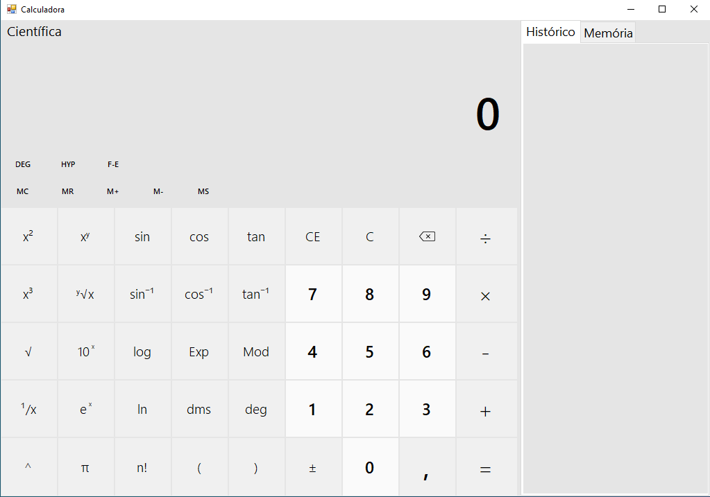

# Calculadora Cientifica do Windows feito na línguagem Csharp 

### Utilizando WindowsFroms

     
    <a href="https://github.com/MauricioMbala02">Meu Perfil.: https://github.com/MauricioMbala02</a>
      
   <h2>&copy; Maurício Mbala | Lezard Crew</h2>

